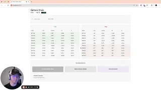

## Watch this video to learn how to use my project!

## Description  

This project was built with a **Java Spring Boot** backend and a **React TypeScript** frontend.  
It integrates with [Polygon.io](https://polygon.io/) to fetch both options and stock pricing data.  

**Note:** The data is delayed by 15 minutes due to Polygon's various pricing tiers.  
